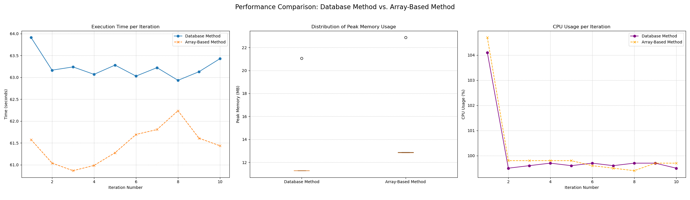
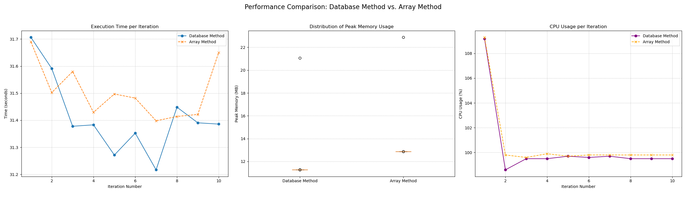

## First Generation Method: Array-Based Approach
In our array-based approach, decks were generated in memory and exported directly into files. This method was simple to implement and ran quickly for small-scale tests. Computer A runtimes with this approach were consistently around 102 seconds with memory use varying from 12-21 MB and Computer B runtimes averaged about 61 seconds with memory use near 13 MB. This approach is lightweight, but is limited in its ability to scale up to very large numbers of decks. 

## Second Generation Method: Database Approach 

In our second approach we used a database to manage generation and storage instead of keeping everything in memory. In this approach, decks were inserted into a SQLite database and exported in batches. This added a small amount of runtime (additonal 2 seconds on average), but was consistently more memory efficient, remaining around 11 MB on all tests regardless of scale. 

## Selection and Reasoning 

Based on the runtime and memory results (stored in our "figures" folder), the database approach proved to be the better method due to its conistent memory usage and stability. We have chosen to prioritize effeciency in managing resources when working with large numbers of decks over computational speed. As of now, we have preserved both methods, wih the user being able to use our array-based approach when using the argument --array in conjunction with running the test.py file.

### Figures

Here are two figures that summarize our results:

